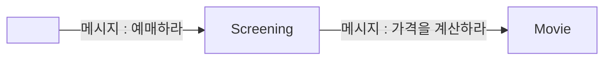

# 코멘트
[[2. 객체지향 프로그래밍|2장]]부터 **메시지**라는 키워드가 자주 언급되고 있다.

설명을 들어보니 그냥 **메서드 호출**인 것 같은데, 왜 굳이 헷갈리게 **메시지**라고 말하는 것일까? 책에서도 나름 상세히 설명되어있긴 하지만, 이마저도 내게는 추상적으로 다가왔다. 그래서 내가 이해한 대로 해석해 보겠다. (틀릴 수 있음)

절차지향 프로그래밍에서는 아래 코드처럼 여러 가지 프로시저와 함수를 호출하여 영화를 예매하게 된다.

```pascal
begin
	InitializeConcert(selectedConcert, '기리보이 콘서트', 80000);
	seatNumber := 42;
	ReserveSeat(seatNumber);
	totalPrice := CalculatePrice(selectedConcert);
end;
```

하지만 객체지향 프로그래밍에서는 객체끼리의 협력을 중요하게 생각한다. 따라서 아래처럼 객체를 만들 수 있다.

```java
abstract class Ticket {
    private String title;
    private double price;

    // 생성자 생략

	abstract void printInfo(); // 티켓 정보 출력
}
```

```java
class MovieTicket extends Ticket {
    // 생성자 생략 

    @Override
    void printInfo() {
        System.out.println("이 티켓은 영화 티켓입니다.");
        System.out.println("영화 제목 : " + getTitle());
    }
}
```

```java
class ConcertTicket extends Ticket {
    // 생성자 생략 
    
    @Override
    void printInfo() {
        System.out.println("이 티켓은 콘서트 티켓입니다.");
        System.out.println("콘서트 명 : " + getTitle());
    }
}
```

위처럼 `객체의 다형성`으로 인해 `Ticket` 객체의 `printInfo()`라는 같은 메서드를 실행하더라도, 정확히 어떤 `printInfo()`가 실행되는지 런타임에 추측할 수 있다. 아래는 그 예시이다.

```java
// Upcasting
Ticket movieTicket = new MovieTicket('영화 아바타', 13_000); // 영화 티켓
Ticket conertTicket = new ConcertTicket('기리보이 콘서트', 80_000); // 콘서트 티켓

// printInfo() 호출
movieTicket.printInfo();
concertTicket.printInfo();
```

위 코드를 보면 `movieTicket.printInfo()`와 `concertTicket.printInfo()` 호출 시점에서 어떤 클래스의 `printInfo` 메서드가 호출될지는 런타임에 결정된다. (*= 지연 바인딩*)

다시 말해, 이러한 객체지향 프로그래밍의 특성으로 인해, *'어떤 정확한 구현을 호출해줘'* 라는 게 불가능하다. 따라서 *'...작업을 처리해'* 라는 메시지를 보내면 객체가 *'알아서'* 실제 메소드를 호출하게 된다는 의미인 것 같다. **메시지**란 키워드는 사람들이 마치 대화하듯이, 객체가 스스로 판단하고 행동할 수 있음을 강조하는 것 같다.

# 정리
책의 저자는 이번 챕터에서 **객체지향 패러다임 관점**에서 핵심은 **역할**, **책임**, **협력**이라고 말하고 있다.
## 역할, 책임, 협력
> 책임 : 객체가 맡은 임무, 행위
> 역할 : 책임의 집합 (== 주로 어떠한 일을 하는 객체인가?의 답)
> 협력 : 내가 처리하기 에매한 일들을 다른 객체와 협력해서 처리 -> 다른 협력하자고 메시지를 보냄

만일 `Ticket`이라는 객체를 만든다고 가정해보자.

```java
class Ticket {

}
```

티켓이라는 객체니깐 왠지모르게 티켓정보를 담을 필드를 먼저 작성하고 싶어진다.

```java
class Ticket {
    private String title;
    private double price;
    private double discountPercent;
    private boolean isRefunded = false; // 환불 여부
    
    // 이에 맞는 게터 세터...
	public double getPrice() {
		return this.price;
	}

	public boolean isRefunded() {
		return this.isRefunded;
	}
}
```

하지만 이런 설계 절차는 **데이터 주도 설계**에 가까우며, 자칫하면 *과도한 인터페이스*를 만들게 될 수 있다. 이런 습관은 객체지향 입문자들의 주된 실수이며 *캡슐화를 망치는 지름길*이라고 한다.
따라서 객체를 설계할때는 객체가 맡을 책임과 행위에 집중해야 한다. 이를 **책임 주도 설계**라고 한다. 따라서 요구사항을 생각하며 사용자에게 제공해야하는 책임들을 파악한다. 아래처럼 말이다.

- 대충 예상되는 책임들
	1. 티켓 예매
	2. 티켓 가격 계산
	3. 티켓 환불
	4. ....

```java
abstract class RefundableTicket {  
  // ....
  final void refund() {
    if (daysBeforeEvent >= 10) {
		System.out.println("티켓이 전액 환불되었습니다.");
	} else {
		System.out.println("환불 불가능한 시점입니다.");
	}
  }
}
```

```java
public class ConcertTicket extends RefundableTicket {  
  // ...
}
```

그리고 이러한 책임들을 좀 더 작은 책임으로 분할하고, 나눠진 각 책임들을 수행할 적절한 객체로 보내버린다. (없다면 새로 만들던지.)
> 3. **티켓 환불** => *별도의 환불 정책이 있다면 책임을 나눈다*.
> 예를들어 아래와 같은 환불 정책이 있다고 해보자.
> 	- 영화 티켓은 상영 30분전까지 무조건 100% 환불.
> 	- 콘서트 티켓은 7일전까지 환불가능하며, 환불일별로 금액이 상이.

```java
interface RefundPolicy {
    double calculateRefundAmount(Ticket ticket, LocalDate eventDate, LocalDate cancelDate);
}

class MovieRefundPolicy implements RefundPolicy {
    @Override
    public double calculateRefundAmount(Ticket ticket, LocalDate eventDate, LocalDate cancelDate) {
        long minutesBeforeEvent = ChronoUnit.MINUTES.between(cancelDate.atStartOfDay(), eventDate.atStartOfDay());
        if (minutesBeforeEvent >= 30) {
            System.out.println("티켓이 전액 환불되었습니다.");
            return ticket.getPrice();
        } else {
            System.out.println("환불 불가능한 시점입니다.");
            return 0;
        }
    }
}

class ConcertRefundPolicy implements RefundPolicy {
    @Override
    public double calculateRefundAmount(Ticket ticket, LocalDate eventDate, LocalDate cancelDate) {
        long daysBeforeEvent = ChronoUnit.DAYS.between(cancelDate, eventDate);
        double refundAmount;

        if (daysBeforeEvent >= 10) {
            refundAmount = ticket.getPrice();
            System.out.println("티켓이 전액 환불되었습니다.");
        } else if (daysBeforeEvent == 9) {
            refundAmount = ticket.getPrice() * 0.9;
            System.out.println("티켓 금액의 90%가 환불되었습니다.");
        } else if (daysBeforeEvent == 8) {
            refundAmount = ticket.getPrice() * 0.8;
            System.out.println("티켓 금액의 80%가 환불되었습니다.");
        } else if (daysBeforeEvent == 7) {
            refundAmount = ticket.getPrice() * 0.5;
            System.out.println("티켓 금액의 50%가 환불되었습니다.");
        } else {
            System.out.println("환불 불가능한 시점입니다.");
            return 0;
        }

        return refundAmount;
    }
}
```

이렇게 하면 자연스러운 협력관계가 만들어질 수 있다고 한다. 

