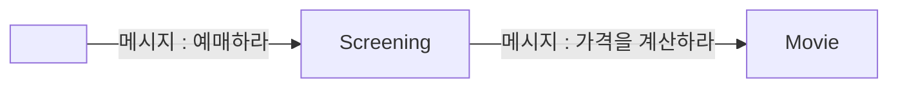

# 코멘트
[[2. 객체지향 프로그래밍|2장]]부터 **메시지**라는 키워드가 자주 언급되고 있다.

설명을 들어보니 그냥 **메서드 호출**인 것 같은데, 왜 굳이 헷갈리게 **메시지**라고 말하는 것일까? 책에서도 나름 상세히 설명되어있긴 하지만, 이마저도 내게는 추상적으로 다가왔다. 그래서 내가 이해한 대로 해석해 보겠다. (틀릴 수 있음)

절차지향 프로그래밍에서는 아래 코드처럼 여러 가지 프로시저와 함수를 호출하여 영화를 예매하게 된다.

```pascal
begin
	InitializeConcert(selectedConcert, '기리보이 콘서트', 80000);
	seatNumber := 42;
	ReserveSeat(seatNumber);
	totalPrice := CalculatePrice(selectedConcert);
end;
```

하지만 객체지향 프로그래밍에서는 객체끼리의 협력을 중요하게 생각한다. 따라서 아래처럼 객체를 만들 수 있다.

```java
abstract class Ticket {
    private String title;
    private double price;

    // 생성자 생략

	abstract void printInfo(); // 티켓 정보 출력
}


```

```java
class MovieTicket extends Ticket {
    // 생성자 생략 

    @Override
    void printInfo() {
        System.out.println("이 티켓은 영화 티켓입니다.");
        System.out.println("영화 제목 : " + getTitle());
    }
}
```

```java
class ConcertTicket extends Ticket {
    // 생성자 생략 
    
    @Override
    void printInfo() {
        System.out.println("이 티켓은 콘서트 티켓입니다.");
        System.out.println("콘서트 명 : " + getTitle());
    }
}
```

위처럼 `객체의 다형성`으로 인해 `Ticket` 객체의 `printInfo()`라는 같은 메서드를 실행하더라도, 정확히 어떤 `printInfo()`가 실행되는지 런타임에 추측할 수 있다. 아래는 그 예시이다.

```java
// Upcasting
Ticket movieTicket = new MovieTicket('영화 아바타', 13_000); // 영화 티켓
Ticket conertTicket = new ConcertTicket('기리보이 콘서트', 80_000); // 콘서트 티켓

// printInfo() 호출
movieTicket.printInfo();
concertTicket.printInfo();
```

위 코드를 보면 `movieTicket.printInfo()`와 `concertTicket.printInfo()` 호출 시점에서 어떤 클래스의 `printInfo` 메서드가 호출될지는 런타임에 결정된다. (*= 지연 바인딩*)

다시 말해, 이러한 객체지향 프로그래밍의 특성으로 인해, *'어떤 정확한 구현을 호출해줘'* 라는 게 불가능하다. 따라서 *'...작업을 처리해'* 라는 메시지를 보내면 객체가 *'알아서'* 실제 메소드를 호출하게 된다는 의미인 것 같다. **메시지**란 키워드는 사람들이 마치 대화하듯이, 객체가 스스로 판단하고 행동할 수 있음을 강조하는 것 같다.


# 정리
