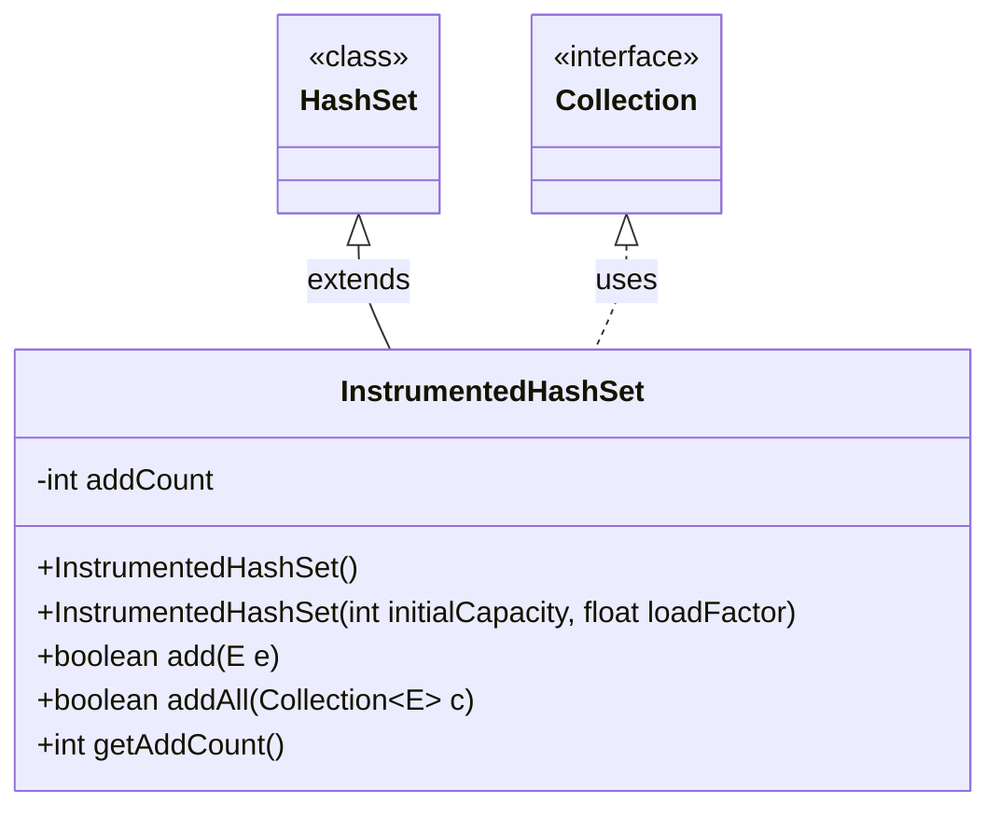
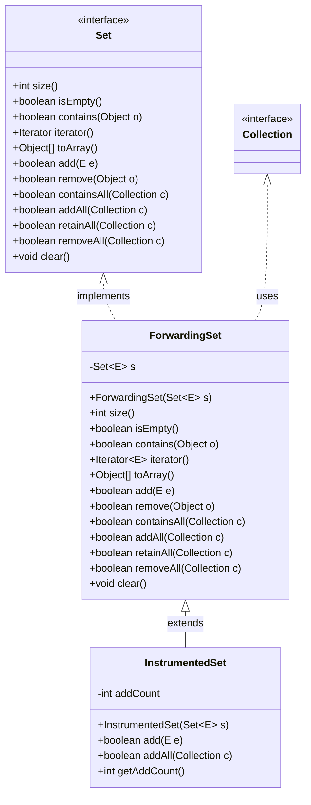

`HashSet` 자료구조에 element add를 몇번 진행 했는지 확인하는 기능을 붙이고 싶어서 다음과 같은 코드를 작성했다.

```java
public class InstrumentedHashSet<E> extends HashSet<E> {  
  
  private int addCount = 0;  
  
  public InstrumentedHashSet() {  
  }  
  public InstrumentedHashSet(int initialCapacity, float loadFactor) {  
    super(initialCapacity, loadFactor);  
  }  
  
  @Override  
  public boolean add(E e) {  
    addCount++;  
    return super.add(e);  
  }  
  
  @Override  
  public boolean addAll(Collection<? extends E> c) {  
    addCount += c.size();  
    return super.addAll(c);  
  }  
  
  public int getAddCount() {  
    return addCount;  
  }  
}
```
^extends-problem-code


다음은 추가할 때 마다 `addCount`를 그만큼 증가시키는 코드이다.
`addAll`을 통해 3개의 아이템을 추가해보면, 일반적으로 `addCount`의 기댓값은 `3`일 것이다.

```java
InstrumentedHashSet<String> s = new InstrumentedHashSet<>();  
s.addAll(Set.of("1", "2", "3"));  
System.out.println(s.getAddCount());
```

하지만 실제 값은 `6`인 모습을 확인 할 수 있다.
`AbstractCollection.java`에서 `addAll` 의 구현을 직접 확인해보자.

```java
public boolean addAll(Collection<? extends E> c) {  
    boolean modified = false;  
    for (E e : c)  
        if (add(e))  
            modified = true;  
    return modified;  
}
```

`line 4`에서 인자로 들어온 컬렉션을 반복문으로 하나씩 `add`하는 모습을 확인할 수 있었다.
참고로 여기서 사용된 `add`는 우리가 직접 *Override*한 아래 코드이다.

```java
@Override  
public boolean add(E e) {  
  addCount++;  
  return super.add(e);  
}
```

따라서 `addCount`의 기댓값 `3`이 아닌 실제값 `6`이 나온것이다.

이제 우리는 `HashSet`의 `addAll`은 자신의 `add`를 사용하는 것을 알았으니, `InstrumentedHashSet`의 코드를 다음처럼 수정할 수 있다.

```java
@Override  
public boolean addAll(Collection<? extends E> c) {  
  // addCount += c.size();  
  return super.addAll(c);  
}
```

그러면 기댓 값 `3`을 확인할 수 있다.

*근데 과연 이것이 해법 일까?*
이러한 접근법은 `HashSet`의 `addAll`이 무조건 `add`를 사용한다는 가정이 있다.
또한 `HashSet`은 우리가 직접 작성한 클래스가 아니기 때문에, 추후 다음 자바 릴리즈에서 수정 되어 `InstrumentedHashSet` 동작이 깨질 가능성이 존재한다.

그럼 다른 방법을 다시 고안해보자. `addAll`을 한땀 한땀 재구현하는 방법이 있다. 아래처럼 말이다.
```java
@Override  
public boolean addAll(Collection<? extends E> c) {  
  boolean modified = false;  
  for (E e : c) {  
    if (add(e)) {  
      modified = true;  
    }  
  }  
  
  return modified;  
}
```
근데 이러한 방식도 문제점이 존재한다.
일단 한땀 한땀 재구현하기 때문에 시간이 더 들며, 성능에 영향을 줄 수 있고, 어렵기 때문이다.
그리고 애초에 부모의 private 필드 변수를 사용해야 한다면, 이런 접근 방식이 불가능해진다.


# 상속보다는 컴포지션을 사용하라
컴포지션을 통해 기존 클래스를 private 필드로 선언했다.

```java
public class ForwardingSet<E> implements Set<E> {  
  // 기존 클래스를 Private 인스턴스로 선언 -> Composition  
  private final Set<E> s;  
  
  public ForwardingSet(Set<E> s) { this.s = s; }  
  
  // Set methods -> 기존 클래스에 대응하는 메서드를 호출  
  @Override public int size() { return s.size(); }  
  @Override public boolean isEmpty() { return s.isEmpty(); }  
  @Override public boolean contains(Object o) { return s.contains(o); }  
  @Override public Iterator<E> iterator() { return s.iterator(); }  
  @Override public Object[] toArray() { return s.toArray(); }  
  @Override public <T> T[] toArray(T[] a) { return s.toArray(a); }  
  @Override public boolean add(E e) { return s.add(e); }  
  @Override public boolean remove(Object o) { return s.remove(o); }  
  @Override public boolean containsAll(Collection<?> c) { return s.containsAll(c); }  
  @Override public boolean addAll(Collection<? extends E> c) { return s.addAll(c); }  
  @Override public boolean retainAll(Collection<?> c) { return s.retainAll(c); }  
  @Override public boolean removeAll(Collection<?> c) { return s.removeAll(c); }  
  @Override public void clear() { s.clear(); }  
}
```

또한 기존에 대응하는 메서드들이 실행되겠끔 `Set` 인터페이스를 구현 해주었다.
이렇게 작성된 메서드들은 필드의 기본 작동방식에 따라 동작하도록 정의되었다.

이렇게 만든 `ForwardingSet`을 상속하여 기존 처럼 코드를 작성해보자.

```java
public class InstrumentedSet<E> extends ForwardingSet<E> {  
  private int addCount = 0;  
  
  public InstrumentedSet(Set<E> s) {  
    super(s);  
  }  
  
  @Override  
  public boolean add(E e) {  
    addCount++;  
    return super.add(e);  
  }  
  
  @Override  
  public boolean addAll(Collection<? extends E> c) {  
    addCount += c.size();  
    return super.addAll(c);  
  }  
  
  public int getAddCount(){ return addCount; }  
}
```

```java
InstrumentedSet<String> s = new InstrumentedSet<>(new HashSet<>());  
s.addAll(List.of("1", "2", "3"));  
System.out.println(s.getAddCount());
```

이제서야 기댓 값 `3`이 나옴을 확인할 수 있었다.

*왜 이렇게 동작되는가?*

[[#^extends-problem-code|기존에 문제가 되었던 코드]]의 UML을 그려보면 다음과 같다.


`HashSet`의 상속을 받은 `InstrumentedHashSet` 객체에서 Override하게 된다면, 추후 HashSet의 구현이 바뀐다면 자식 객체의 기능이 깨질 수 있었다.
- HashSet의 구현이 바뀐다는 가정 : addAll이 반복문으로 자신의 add를 호출하는 것이 아닌, 별도의 구현으로 동작 한다던지... 등


이제 개선한 코드의 UML을 그려보자.

`InstrumentedSet`에서 컴포지션을 통해 `Set`을 Wrapping한 객체(`ForwardingSet`)을 사용했기 때문에 실제 `HashSet`의 내부 구현이 변경되어도 원하는 대로 동작함을 기대할 수 있다.