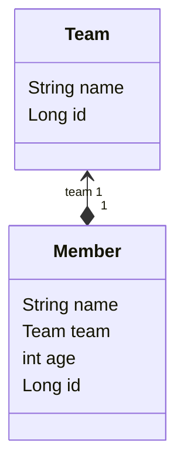

JPA 에서 #연관관계 를 조회할때는 `지연로드`(*LAZY*), `즉시로드`(*EAGER*) 방식이 있다.  
기본적으로 즉시로드로 설정되어 있다. 지연로드 방식으로 변경 하려면 다음처럼 `fetch`값을 변경한다.

```java
@Entity  
public class Member {  
//..
  @ManyToOne(fetch = FetchType.LAZY) // <- 요렇게
  private Team team;
//..
}
```

해당 글에서는 코드를 가지고 설명을 이어갈 것인데,
이를 위해 공통으로 사용할 엔티티 도메인에 대해 간략히 설명하겠다.

```java
@Entity  
public class Member {  
//..
  @ManyToOne(fetch = FetchType.LAZY)
  private Team team;
//..
}
```

```java
@Entity
public class Team {  
//..  
  private String name;
}
```

간단하게 다이어그램으로 표현해보면 다음과 같다.

## #지연로드
`지연로드`는 값을 실제로 필요로 할때 조회가 이뤄지는 것이다. 

### 지연로드가 필요한 이유
멤버의 나이만 출력하는 코드가 있다.
```java
Member member = entityManager.find(Member.class, 1L);  
System.out.println("멤버의 나이 : " + member.getAge());
```

*즉시로드라 가정하고* 코드를 실행해보면 :
```
Hibernate: select m1_0.id,m1_0.age,m1_0.name,t1_0.id,t1_0.name from member m1_0 left join team t1_0 on t1_0.id=m1_0.team_id where m1_0.id=?
멤버의 나이 : 25
```

우리가 활용하지도 않을 **Team**까지 *join*되어 한방 쿼리가 나가게된다.
이게 연관관계가 Team 하나라 다행이지, 수백개의 연관관계가 있다면 **상당히 비 효율적**일 것이다.

*지연로드*라 가정하고, 실행하면 :
```
Hibernate: select m1_0.id,m1_0.age,m1_0.name,m1_0.team_id from member m1_0 where m1_0.id=?
멤버의 나이 : 25
```

이렇게 join없이 단순한 쿼리만 나간다.
### 눈으로 지연로드를 확인해보자
이러한 *엔티티 도메인*에서 *PK*가 1인 **Member**를 조회하면, 소스코드는 아래와 같다.

```java
Member member1 = entityManager.find(Member.class, 1L);  
System.out.println("사람 이름을 출력합니다. -> " + member1.getName());  
System.out.println("팀 이름을 출력합니다. -> " + member1.getTeam().getName());
```

**출력된 결과**를 확인하면 아래와 같다.

```
Hibernate: select m1_0.id,m1_0.age,m1_0.name,m1_0.team_id from member m1_0 where m1_0.id=?
사람 이름을 출력합니다. -> 1번 타자 홍길동
Hibernate: select t1_0.id,t1_0.name from team t1_0 where t1_0.id=?
팀 이름을 출력합니다. -> LG Twins
```

*여기서 눈 여겨볼 포인트는...*

- 처음부터 Member 접근할때 Team까지 조회하지 않았다. (_출력된 결과 line 1_)
```
Hibernate: select m1_0.id,m1_0.age,m1_0.name,m1_0.team_id from member m1_0 where m1_0.id=?
```

- 실제 **Team** 값을 **Access**하려고 하자, Team조회 쿼리가 나갔다. (_출력된 결과 line 3-4_)
```
사람 이름을 출력합니다. -> 1번 타자 홍길동
Hibernate: select t1_0.id,t1_0.name from team t1_0 where t1_0.id=?
팀 이름을 출력합니다. -> LG Twins
```
> member1.getTeam().getName() 이 호출될때 그제서야 쿼리가 나감.

값에 언제 접근할지 어떻게 알고 **지연로드**가 동작하는걸까?
### 지연로드가 동작하는 방식
지연로드가 동작하는 방식을 이해하려면 #프록시패턴 에 대해 선행되어야 한다.
![[프록시 패턴#프록시 패턴 이란]]

> Proxy, 대리 (???) 로 지연로드를 도대체 어떻게 하는데?

**Member**객체에서 **Team**을 가져오는 `.getTeam()` 호출을 **실제 Member 객체가 아니라**,
**Member 대리 객체에게 요청**하는 것이라 생각해보자.  
그리고 Member 대리객체에서 `.getTeam()` 이 호출될때 일련의 추가작업을 진행하면 된다.
- 영속성 컨텍스트 초기화 작업
- 실제 쿼리로 조회

실제로 다음 코드를 실행해서, Team의 클래스 명을 보면,
```java
Member member1 = entityManager.find(Member.class, 1L);  
System.out.println(member1.getTeam().getClass().getName());
```

말로만 하면 와닿지 않을 수 있으니, 코드로 이해를 해보자.

다음과 같은 **Member** 객체가 있다.
```java
@Entity  
@Getter @Setter
public class Member {  
  @ManyToOne(fetch = FetchType.LAZY)
  private Team team;
}
```

**Member**의 **Proxy Object**의 코드는 다음처럼 생겼을 것이다.
```java
public class MemberProxy extends Member {
  private target = null;

  public Team getTeam(){
    if (target == null) {
      // 초기화 작업
    }

    return target.getTeam();
  }
}
```

#### 실제로 프록시 객체가 쓰이는지 어떻게 아나??
단순하게 콘솔에 클래스 이름을 찍어보면 된다.

```java
Member member = entityManager.find(Member.class, 1L);  
String proxyTeamClassName = member.getTeam().getClass().getName();  
System.out.println("proxyTeamClassName = " + proxyTeamClassName);
```

출력 결과:
```
proxyTeamClassName = kr.huni.jpabook.Team$HibernateProxy$IAL7B70F
```

출력된 클래스명을 확인해보면
*kr.huni.jpabook.Team* **\$HibernateProxy\$IAL7B70F**
원래 클래스 이름 뒤에 **구질구질하게** 붙어진걸 볼 수 있다.
실제 객체가 아닌 프록시 객체가 사용된다는 뜻이다.


## #즉시로드
앞서 말했듯 기본적으론 즉시로드를 한다.


### (참고) 즉시로드에서 Join 전략
> PK가 `nullable` 하지 않다면, 이를 명시함으로써 성능향상을 기대할 수 있다.

SQL에서 Join은 크게 두가지가 있다. [[SQL의 조인#SQL Join]] 참고.
기본적으로 JPA에서 연관관계를 명시할땐 PK가 `Nullable`하다는게 기본 설정이다.

엔티티 클래스에서 PK가 `Nullable`로 명시되어 있으면 [[SQL의 조인#Outer Join]]으로 쿼리가 나가고,
```mysql
select m1_0.id,m1_0.age,m1_0.name,t1_0.id,t1_0.name from member m1_0 left join team t1_0 on t1_0.id=m1_0.team_id where m1_0.id=?
```
`Nullable`하지 않다면 [[SQL의 조인#Inner Join]]으로 쿼리가 나간다.
```mysql
select m1_0.id,m1_0.age,m1_0.name,m1_0.team_id,t1_0.id,t1_0.name from member m1_0 join team t1_0 on t1_0.id=m1_0.team_id where m1_0.id=?
```

추가적으로 : `@JoinColumn`에 `nullable`를 명시해주어도 똑같은 기대값을 가진다.
