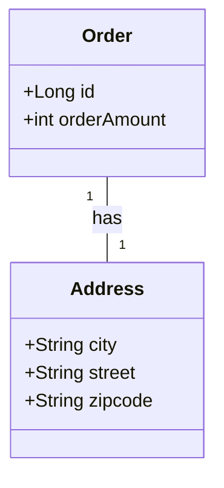

`JPA`는 통계와 같은 복잡한 쿼리를 위해 다음과 같은 쿼리 기술을 사용한다.
- 객체지향 쿼리
	- `JPQL`
	- `Criteria`
	- `QueryDSL`
- 그냥 쌩 SQL
	- `네이티브 쿼리`

`JPQL`**이 가장 핵심인 이유**는, `Criteria`, `QueryDSL`은 `JPQL`을 사용하기 쉽게 만드는 기술이기 때문이다. 따라서 우리는 `JPQL`을 필수적으로 학습해야 한다.

# Criteria
`JPQL`을 생성하는 빌더 클래스이다.

```java
CriteriaBuilder cb = em.getCriteriaBuilder();  
CriteriaQuery<MemberJPQL> query = cb.createQuery(MemberJPQL.class);  
  
CriteriaQuery<MemberJPQL> cq = query  
    .select(query.from(MemberJPQL.class))  
    .where(cb.equal(query.from(MemberJPQL.class).get("name"), "회원1"));  
  
List<MemberJPQL> resultList = em.createQuery(cq).getResultList();
```

사용 예를 보면 알겠지만, 빌더 패턴을 통해 **SQL를 JAVA 코드처럼** 작성할 수 있다. 오탈자 오류를 런타임 시점이 아닌 컴파일 시점에 받고 싶다면, 메타 모델을 생성해 주는 `hibernate-jpamodelgen`을 사용하면 된다.  
  
코드로 작성하기 때문에 `JPQL`보단 편하지만 한눈에 잘 읽히진 않는다.
# QueryDSL
`Criteria`처럼 `JPQL` 빌더 역할을 한다. `Criteria`과는 달리 한눈에 읽힌다는 장점이 있다.
# Native query (쌩 쿼리)
네이티브 쿼리는 쌩 SQL을 직접 사용할 수 있다.
```java
String sql = "select * from memberjpql where name = '회원1'";  
List<MemberJPQL> resultList = em.createNativeQuery(sql, MemberJPQL.class) 
    .getResultList();
```
주로 특정 데이터베이스에 의존하는 기능(*st_distance_sphere*)들을 사용할 때 네이티브 쿼리를 사용한다. 단점으론 사용하는 데이터베이스를 변경하면 네이티브 쿼리 `SQL`도 전부 수정해야 한다.
# JPQL (객체지향 SQL)
> Java Persistence Query Language

우리는 `ORM`을 사용하기 때문에, `Table`이 아닌 `엔티티 객체`를 다룬다. **따라서 데이터를 검색할 때 테이블이 아닌 엔티티 객체 대상으로 검색되어야 한다.** 이러한 배경에서 나오게 된 것이 `JPQL`다.  
  
`JPQL`의 특징은 다음과 같다.  
- 테이블이 아닌 객체를 대상으로 검색하는 객체지향 쿼리  
- SQL을 추상화해서 특정 데이터베이스 SQL에 의존하지 않음

기본적으로 이렇게 사용한다.
```java
String jpql1 = "select m from MemberJPQL m where m.name = '회원1'";  
List<MemberJPQL> resultList = em.createQuery(jpql1, MemberJPQL.class)  
    .getResultList();
```

`JPQL`이 `SQL`과 비슷하다고 생각할 수 있다. 하지만 `JPQL`은 엔티티 직접 조회, [묵시적 조인](JPQL%20묵시적%20조인.md), 다형성 지원으로 **SQL보다 간결하다.**

## SELECT 문
기본적으로 `SELECT`는 다음처럼 사용한다.
```sql
SELECT m FROM MemberJPQL AS m WHERE m.name = '회원1'
```
*엔티티와 속성들은 대소문사를 구분하므로 유의해서 사용해야한다.*

- 엔티티 이름
`FROM` 다음 사용되는 target은 테이블 명이 아닌 엔티티 명이다. 엔티티 클래스에 `@Entity(name = 'xxx')`으로 명시된 이름을 사용해야 한다.

- 별칭 AS
`엔티티명 AS 별칭`으로  별칭을 준 후
```sql
MemberJPQL AS m -- 별칭 명시
```
이 별칭으로 프로젝션을 기입 해야한다.
```sql
SELECT m.username .... -- 별칭 사용
```
### TypeQuery, Query
만약 반환 타입이 엔티티로 명확하다면 `TypedQuery`를 사용하고,
그렇지 않다면 `Query`를 사용한다.

- TypedQuery
```java
TypedQuery<MemberJPQL> query = em.createQuery("select m from MemberJPQL m", MemberJPQL.class);  
List<MemberJPQL> resultList = query.getResultList();
```
이처럼 쿼리 결과가 `MemberJPQL` 엔티티로 명확(**MemberJPQL**)하여 `TypedQuery`를 사용했다.

- Query
```java
Query query = em.createQuery("select m.name, m.age from MemberJPQL m");  
List resultList = query.getResultList();
```
이처럼 쿼리 결과가 엔티티로 딱 나오지 않을 때 `Query`를 사용한다.  
`Query`는 조회 대상의 갯수에 따라 `Object` 혹은 `Object[]`를 반환 하므로, 만일 결과를 사용하고 싶다면 다음처럼 하면 된다.  ^mapping-query-to-object
```java
Query query = em.createQuery("select m.name, m.age from MemberJPQL m");  
List resultList = query.getResultList();  
  
for (Object o : resultList) {  
  // 조회 대상이 둘 이상이라서 Object[]
  Object[] result = (Object[]) o;  
  System.out.println("name = " + result[0]);  
  System.out.println("age = " + result[1]);  
}
``` 

실행 결과:
```
name = 회원1
age = 1
name = 회원2
age = 2
name = 회원3
age = 3
name = 회원4
age = 4
```

### 결과 값 주의사항
- `.getResultList()`는 결과값이 없을때 빈 컬렉션을 반환한다.
- `.getSingleResult()`는 결과값이 정확히 하나일 때 사용한다.
	- 결과가 없거나, 결과가 1개보다 많으면 예외가 발생하기 때문에 이를 직접 처리해줘야 한다.

### 파라미터 바인딩
> Parameter Binding

`where`절에 값을 넣을때 **파라미터 바인딩**을 사용해야 한다. `JPQL`에선 두가지 `파라미터 바인딩`을 지원한다.

- **이름 기준 파라미터 바인딩**
`.setParameter(바인딩 할 이름, 기입할 값)`를 통해 쿼리에 값을 바인딩 할 수 있다.
쿼리에선 `:name` 처럼 나타내면 된다.
```java
String query = "select m from MemberJPQL m where m.name = :name";  
List<MemberJPQL> resultList = em.createQuery(query, MemberJPQL.class)  
    .setParameter("name", "회원1")  
    .getResultList();
```

spring-data-jpa 쿼리 메소드에선 다음처럼 사용한다.
```java
@Query(value = "select m from MemberJPQL m where m.name = :name")  
MemberJPQL posParameterTest(String name);
```

- **위치 기준 파라미터 바인딩**
`.setParameter(숫자, 기입할 값)`를 통해 쿼리에 값을 바인딩 할 수 있다.
쿼리에선 `?숫자` 처럼 나타내면 된다.
```java
String query = "select m from MemberJPQL m where m.name = ?1";  
List<MemberJPQL> resultList = em.createQuery(query, MemberJPQL.class)  
    .setParameter(1, "회원1")  
    .getResultList();
```

spring-data-jpa 쿼리 메소드에선 다음처럼 사용한다.
```java
@Query(value = "select m from MemberJPQL m where m.name = ?1")  
MemberJPQL nameParameterTest(String name);
```

*위치 기준 파라미터 바인딩*은 휴먼 에러 가능성이 존재하기에 *이름 기준 파라미터 바인딩* 사용이 권장된다.

#### 파라미터 바인딩을 사용해야는 이유
- 파라미터 바인딩을 사용하지 않으면 `SQL Injection`에 취약할 수 있다.
```java
String userInput = "존재하지 않는 회원' or 1 = 1 -- ";  

String query1 = "select m from MemberJPQL m where m.name = :name";  
List<MemberJPQL> parameterBindResult = em.createQuery(query1, MemberJPQL.class)  
    .setParameter("name", userInput)  
    .getResultList();  
  
String query2 = "select * from memberjpql m where m.name = '" + userInput + "'";  
List<MemberJPQL> noParameterBindResult = em.createNativeQuery(query2, MemberJPQL.class)  
    .getResultList();  
  
assert parameterBindResult.size() == 0; // sql injection not work
assert noParameterBindResult.size() != 0; // sql injection work
```

- 같은 쿼리는 파싱한 결과를 재사용하여 성능 향상을 기대할 수 있다.
### 프로젝션
> projection

`SELECT` 절에 조회할 대상을 지정하는 것을 `프로젝션`이라고 한다.

```sql
SELECT {프로젝션 대상} FROM ...
```

#### 엔티티 프로젝션
프로젝션 대상으로 엔티티를 지정할 수 있다.
```sql
SELECT m FROM Member m
SELECT m.team FROM Member m
```

이렇게 조회한 엔티티는 영속성 컨테스트에서 관리된다.
#### 임베디드 타입 프로젝션
`@Embedded` 타입을 프로젝션으로 지정할 수 있다. 하지만 임베디드 타입은 조회의 시작점이 될 수 없다. 왜냐하면 임베디드 타입은 혼자 단독으로 존재하지 않기 때문이다. [참고](09.%20값%20타입.md#임베디드%20값%20타입%20@Embedded)
따라서 다음처럼 사용할 수 없다.



```sql
SELECT a FROM address a -- address는 embedded 타입이라고 생각
```

예제에서 `Order`가 `Address`를 가지고 있으므로 다음처럼 조회한다.
```sql
SELECT o.address FROM Order o
```

#### 스칼라 타입 프로젝션
클래스가 아닌 숫자, 문자, 날짜 같은 기본 데이터 타입들을 스칼라 타입이라 한다. 

```java
List<String> resultList = em.createQuery("SELECT name FROM MemberJPQL m", String.class)  
    .getResultList();
```

여기서 중복 제거를 하려면 `DISTINCT`를 사용한다.

```java
List<String> resultList = em.createQuery("SELECT DISTINCT name FROM MemberJPQL m", String.class)  
    .getResultList();
```
#### DTO로 검색하기
[여기](#^mapping-query-to-object)에선 Object[]를 통해 쿼리 결과를 매핑했다. 하지만 따로 매핑작업을 거칠 필요 없다.

생성자가 있는 DTO가 있다.
```java
package kr.huni.jpabook.jpql;  
  
public class MemberDTO {  
  
  private final String name;  
  private final int age;  
  
  public MemberDTO(String name, int age) {  
    this.name = name;  
    this.age = age;  
  }   
}
```

조회시 `new` 키워드를 통해 결과를 바로 DTO 객체로 반환할 수 있다.
```java
List<MemberDTO> resultList = em.createQuery(  
        "SELECT new kr.huni.jpabook.jpql.MemberDTO(m.name, m.age) FROM MemberJPQL m",  
        MemberDTO.class)  
    .getResultList();
```
##### 주의사항
- 패키지 명을 포함한 전체 클래스 명을 입력해야 한다.
- 순서와 타입이 일치하는 생성자가 필요하다.
### 페이징 처리
`setFirstResult()`, `setMaxResult()`를 통해 페이징 처리가 가능하다.
```java
TypedQuery<MemberJPQL> query = em.createQuery("select m from MemberJPQL m", MemberJPQL.class);  
  
query.setFirstResult(0);  
query.setMaxResults(10);  
query.getResultList();
```

이렇게 작성된 `JPQL`은 설정된 방언에 따라 사용하는 데이터베이스에 맞게 적절히 변환된다.
### 통계 관련
`JPQL`에서 아래와 같이 통계함수를 사용할 수 있다.
```sql
SELECT
	COUNT(m), -- 회원수
	SUM(m.age), -- 나이 합
	AVG(m.age), -- 나이 평균
	MAX(m.age), -- 나이 최대
	MIN(m.age) -- 나이 최소
FROM Member m
```
#### 집합 함수 사용시 주의점
- `NULL`값은 통계에서 잡히지 않는다. **(무시됨)**
- `DISTINCT`를 집합 함수 안에 사용해서 중복된 값을 제거하고 집합을 구할 수 있다.
```sql
SELECT
	COUNT(DISTINCT m.age)
FROM member m
```
#### GROUP BY, HAVING
> `GROUP BY`는 특정 그룹끼리 묶어준다. 그리고 `HAVING`을 통해 그룹화된 데이터를 필터한다.

```sql
SELECT 
	t.name,
	COUNT(m.age),
	SUM(m.age),
	AVG(m.age),
	MAX(m.age),
	MIN(m.age)
FROM Member m JOIN m.team t
GROUP BY t.name -- 팀 이름으로 묶고
HAVING AVG(m.age) >= 10 -- 팀 평균나이로 필터링
```
### 정렬 (ORDER BY)
> `ORDER BY`는 검색 결과를 정렬할 때 사용한다.

- ASC: 오름차순 (기본값)
- DESC: 내림차순

사용예 :
```sql
SELECT m
FROM Member m
ORDER BY m.age DESC, m.username ASC -- 정렬 조건 여러개도 가능!
```
### JPQL 조인
> SQL 조인과 기능이 같지만, 문법은 약간 다르다.
> 기능 참고 : [SQL의 조인](SQL의%20조인.md)
#### 내부 조인
`SQL`과 마찬가지로 `INNER`를 생략할 수 있으며, `ON`절은 필요없다.
또한 `JOIN`절에선 객체간 연관관계 형태로 나타내야 한다. (e.g `JOIN m.team t`)
```java
String teamName = "LG 트윈스";  
String query = """  
    SELECT m  
    FROM Member m  
    INNER JOIN m.team t  
    WHERE t.name = :teamName  
    """;  
List<Member> resultList = em.createQuery(query, Member.class)  
    .setParameter("teamName", teamName)  
    .getResultList();
```
#### 외부조인
`SQL`과 마찬가지로 `OUTER`를 생략할 수 있다.


