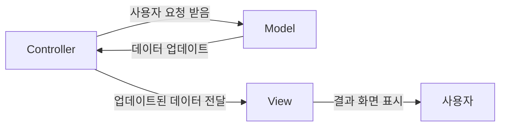

MVC 패턴은 웹 개발시 많이 사용하는 설계 패턴이다.
아래 처럼 역할/관심사 별로 분리해서, 각자 역할에 집중하며 개발할 수 있게 돕는다.

- Model
  요청 처리에 필요한 데이터를 저장/조회하는 역할을 한다.
- View
  실제 화면을 그려주는 레이어다. 사용자의 요청에 대한 결과를 보여주는 역할을 한다.
- Controller (+ Service)
  컨트롤러를 통해서, 사용자의 요청을 식별하고 기능으로 라우팅한다.

전체적인 그림을 도식화하면 아래와 같다.
  

