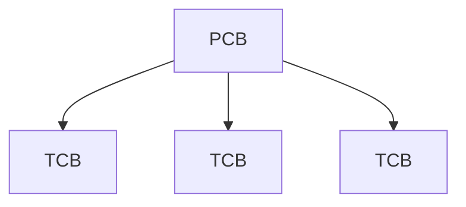
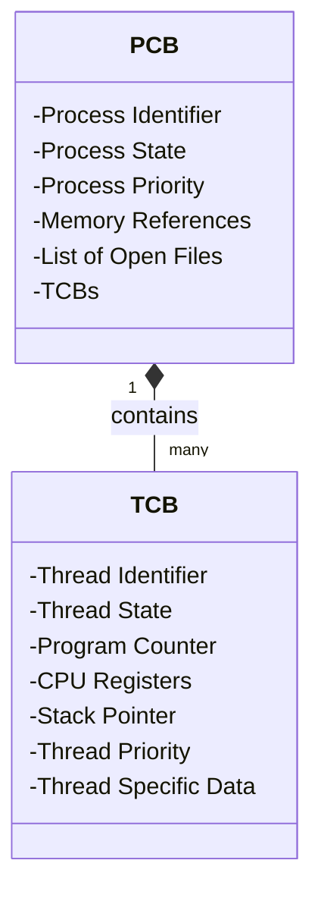

> Thread Control Block

> CPU의 최소 실행단위는 [[Process 프로세스|프로세스]]가 아닌 [[Thread 쓰레드|쓰레드]]이기 때문에 실질적으로 [[Context Switching 컨텍스트 스위칭]]가 일어날때 [[프로세스 제어 블록 (PCB)|PCB]]가 아닌 TCB가 메인 키워드가 될 수 있다.

보통 쓰레드 제어 블록들은 [[프로세스 제어 블록 (PCB)]]내에 포함되는 구조이다.

